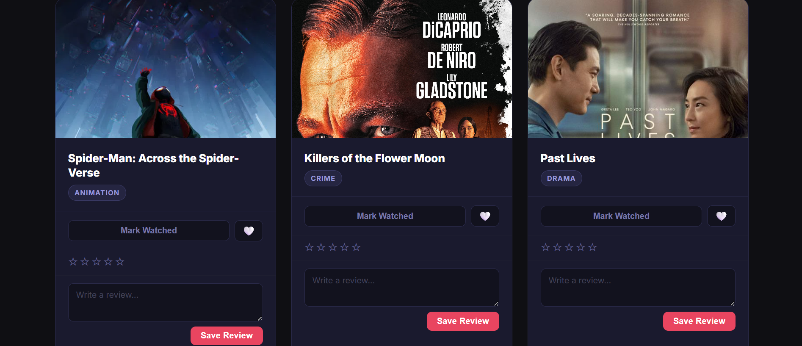

# 🎬 ReelTalk Movie Tracker

A web application that lets users track movies, rate them, write reviews, and enhance them using AI.

---

## 📌 Project Description

ReelTalk is a web application that helps users track movies they want to watch or have already seen. Users can browse a collection of movies, save favorites, mark them as watched, rate them, and write short reviews. ReelTalk also allows filtering by genre or viewing status, helping users organise their personal movie library.

For this assignment, I added an AI-powered feature called the **AI Review Enhancer**. This feature lets users take a rough movie review and improve it using AI. It runs locally using Ollama, so no API key is needed. Users can also choose different tones (professional, casual, funny, dramatic), and the AI adjusts the style based on what they pick.

---

## 📸 Screenshots

### Movie Collection


### Stats Dashboard
<!-- Add a screenshot of the stats section here -->
*Screenshot coming soon*

### AI Review Enhancer
<!-- Add a screenshot of the AI enhancer section here -->
*Screenshot coming soon*

---

## ⚙️ Features

### Core Features
- Browse a collection of movies displayed as cards
- Search movies by title in real time
- Save movies to a personal favourites list
- Mark movies as watched
- Rate movies with a 1–5 star system
- Write short reviews for each movie

### Advanced Features
- Filter movies by genre (Action, Drama, Comedy, etc.)
- Filter movies by watch status (Watched, Favourites)
- Stats dashboard showing watched count, favourites, and average rating
- Reset all filters in one click

### 🤖 AI Feature
- **AI Review Enhancer** — paste a rough review and get back a polished version
- Tone selection: Professional, Casual, Funny, Dramatic
- Loading indicator while the AI is generating
- Clear button to reset input and output
- Descriptive error messages if something goes wrong

---

## 🛠️ Tech Stack

| Layer | Technology |
|---|---|
| Frontend | HTML, CSS, JavaScript |
| Backend | Node.js (no framework) |
| AI Model | Ollama (local) — `llama3` |
| Storage | localStorage |

---

## 🚀 Setup Instructions

### 1. Clone the repository
```bash
git clone https://github.com/Marialehdes/reeltalk-movie-tracker-main.git
cd reeltalk-movie-tracker-main
```

### 2. Install Ollama
Download from [https://ollama.com/download](https://ollama.com/download) and follow the installer.

### 3. Pull the AI model (one-time download, ~4 GB)
```bash
ollama pull llama3
```

### 4. Start both required processes in separate terminals

**Terminal 1 — Ollama:**
```bash
ollama serve
```

**Terminal 2 — Node server:**
```bash
node server.js
```

### 5. Open the app
Open `index.html` in your browser. The AI Review Enhancer at the bottom of the page will be fully functional.

---

## 🤖 AI Integration

This project uses Ollama to run a local AI model (`llama3`).

The AI is used to:
- Improve user-written movie reviews into clearer, more structured write-ups
- Adjust the tone and style of the review based on user selection

The frontend sends the raw review text and chosen tone to a local Node.js server (`server.js`), which forwards the request to Ollama's API at `localhost:11434`. The enhanced review is returned and displayed in the UI.

---

## 🧠 AI Assistance

This project was developed with help from AI tools including Claude and ChatGPT.

AI was used to:
- Help set up and debug API calls between the frontend and backend
- Connect the Ollama integration end-to-end
- Improve feature design and error handling
- Assist with styling and layout decisions

The full AI transcript from the development process is included in the `transcripts/` folder.

---

## ⚠️ Known Limitations

- No user authentication — anyone with access to the browser can see the data
- Data is stored in `localStorage` and is browser-specific (clearing browser data will erase it)
- The AI Review Enhancer only works when both `ollama serve` and `node server.js` are running locally

---

## 📚 What I Learned

Working with AI helped speed up development, especially for generating code and fixing errors. At the same time, I learned that I still needed to understand how APIs work and how the frontend connects to a backend — AI-generated code doesn't always work without knowing what it's doing.

I also learned that AI doesn't always give perfect results right away. I had to adjust prompts and test different approaches to get better outputs. Using Ollama showed me that AI can run locally without needing API keys, which kept the project self-contained and simple to share.

Overall, this project helped me understand APIs, AI integration, and how much testing and debugging goes into making everything actually work together.
